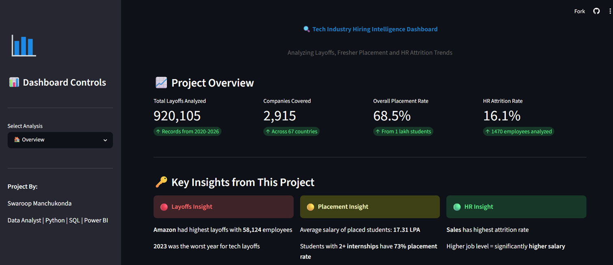
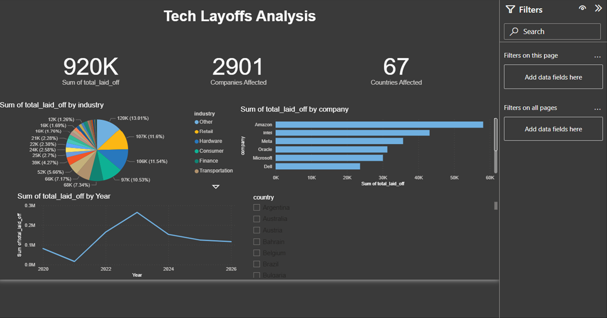
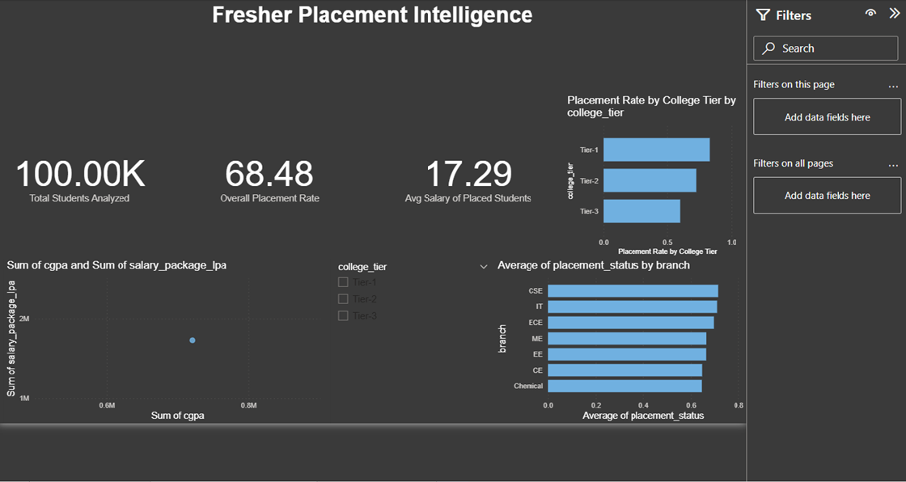
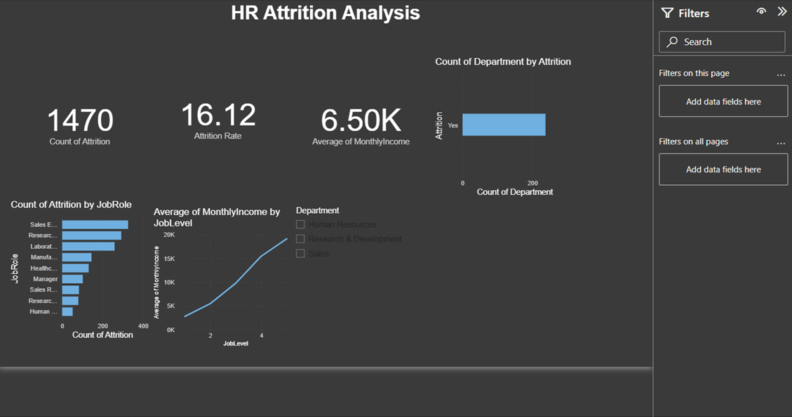
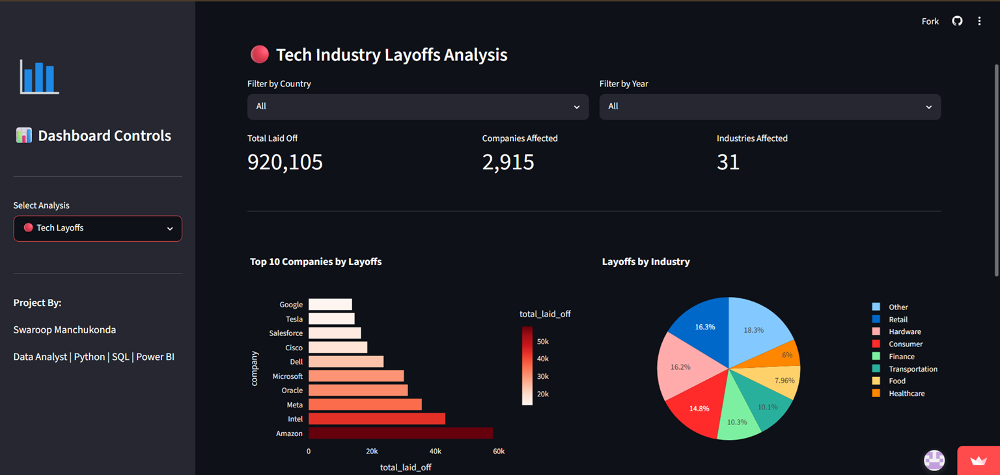
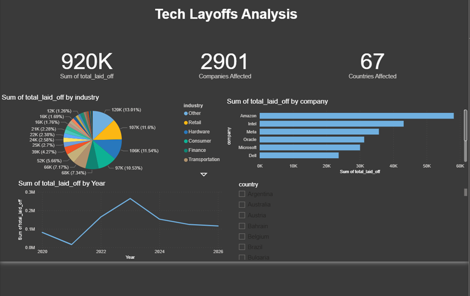

# 🔍 Tech Industry Hiring Intelligence Dashboard


An end-to-end **Data Analytics & Machine Learning** project that analyzes **Tech Layoffs, Student Placement Trends, and HR Employee Attrition** using **Python, SQL, Power BI, Streamlit, and Machine Learning**.

---

## 🌐 Live Demo

🚀 **Live Dashboard:**  
https://tech-hiring-intelligence-dashboard-adumfrvmzxuonvwmbwxjro.streamlit.app/

## 💻 GitHub Repository

🔗 https://github.com/Swaroopmanchukonda26/tech-hiring-intelligence-dashboard

---

# 📌 Project Overview

The **Tech Industry Hiring Intelligence Dashboard** is an interactive analytics platform that provides business insights into hiring trends, layoffs, placements, and employee attrition.

The project combines:

- Data Cleaning
- Exploratory Data Analysis (EDA)
- SQL Business Queries
- Interactive Dashboards
- Machine Learning Prediction
- Web Deployment

making it a complete end-to-end Data Analytics portfolio project.

---

# 📊 Datasets Used

| Dataset | Records | Source |
|---------|---------|--------|
| Tech Layoffs | 4,428 | Kaggle |
| Student Placement | 100,000 | Kaggle |
| HR Employee Attrition | 1,470 | IBM HR Analytics |
| **Total Records** | **105,898** | Multiple Sources |

---

# 📈 Key Business Insights

## 🔴 Tech Layoffs

- Amazon recorded the highest layoffs (**58,124 employees**)
- 2023 witnessed the highest global tech layoffs
- Software & Consumer industries were most affected
- Layoffs increased significantly after the pandemic

---

## 🟡 Student Placement Analysis

- Overall placement rate: **68.5%**
- Students with **2+ internships** achieved approximately **73% placement rate**
- Average placed student salary: **17.31 LPA**
- Higher CGPA generally correlated with better salary packages

---

## 🟢 HR Employee Attrition

- Overall employee attrition rate: **16.1%**
- Sales department experienced higher attrition
- Employees working overtime showed higher resignation rates
- Higher job levels generally received higher salaries

---

# 🤖 Machine Learning Module

The dashboard includes an interactive **Employee Attrition Prediction System** built using Machine Learning.

### Features

- Predict employee attrition
- Interactive prediction form
- Pre-trained ML model
- Instant prediction results

---

# 📊 Dashboard Modules

## 1️⃣ Tech Layoffs Dashboard

- Company-wise layoffs
- Industry analysis
- Yearly trends
- Country-wise layoffs

---

## 2️⃣ Student Placement Dashboard

- Placement percentage
- CGPA vs Salary
- Internship analysis
- Placement by college tier

---

## 3️⃣ HR Analytics Dashboard

- Attrition rate
- Department analysis
- Monthly trends
- Salary insights
- Feature importance

---

## 4️⃣ ML Prediction Dashboard

Predict employee attrition based on employee information using Machine Learning.

---

# 🛠️ Technologies Used

| Technology | Purpose |
|------------|----------|
| Python | Data Processing |
| Pandas | Data Cleaning |
| NumPy | Numerical Computing |
| Matplotlib | Static Visualization |
| Seaborn | Statistical Visualization |
| Plotly | Interactive Charts |
| SQL (SQLite) | Business Analysis |
| Power BI | Dashboard Creation |
| Streamlit | Web Application |
| Scikit-learn | Machine Learning |
| Git & GitHub | Version Control |

---

# 📂 Project Structure

```text
tech-hiring-intelligence-dashboard/
│
├── app/
│   ├── app.py
│   ├── attrition_model.pkl
│   ├── feature_columns.pkl
│   └── label_encoder.pkl
│
├── data/
│   ├── raw/
│   ├── cleaned/
│   └── charts/
│
├── dashboard/
│
├── notebooks/
│
├── SQL/
│
├── requirements.txt
│
└── README.md
```

---

# 📸 Dashboard Preview

## 🏠 Dashboard Overview



---

## 🔴 Tech Layoffs Dashboard



---

## 🟡 Student Placement Dashboard



---

## 🟢 HR Analytics Dashboard



---

## 📊 Interactive Dashboard View



---

## 🤖 Employee Attrition Prediction



# ⚙️ Installation

Clone the repository

```bash
git clone https://github.com/Swaroopmanchukonda26/tech-hiring-intelligence-dashboard.git
```

Go into the project directory

```bash
cd tech-hiring-intelligence-dashboard
```

Install dependencies

```bash
pip install -r requirements.txt
```

Run the Streamlit application

```bash
streamlit run app/app.py
```

---

# 🚀 Future Enhancements

- User Authentication
- Cloud Database Integration
- Live Hiring Data API
- AI-powered Hiring Trend Forecasting
- Resume Screening Module
- Job Recommendation System

---

# 📊 Skills Demonstrated

- Data Cleaning
- Exploratory Data Analysis (EDA)
- Data Visualization
- SQL Query Writing
- Dashboard Development
- Machine Learning
- Model Deployment
- Streamlit Application Development
- Business Intelligence
- Git & GitHub

---

# 🎯 Business Impact

This project demonstrates how data analytics can help organizations:

- Monitor hiring trends
- Understand layoff patterns
- Improve campus recruitment
- Analyze employee attrition
- Support HR decision-making
- Make data-driven hiring decisions

---

# 👨‍💻 Author

**Swaroop Manchukonda**

🎓 B.Tech Student | Aspiring Data Analyst | Business Analyst

GitHub:
https://github.com/Swaroopmanchukonda26

LinkedIn:
(Add your LinkedIn Profile)

---

# ⭐ If you found this project useful

Please consider giving this repository a ⭐ on GitHub.

It motivates me to build and share more data analytics projects.

---

## 📜 License

This project is licensed under the MIT License.
